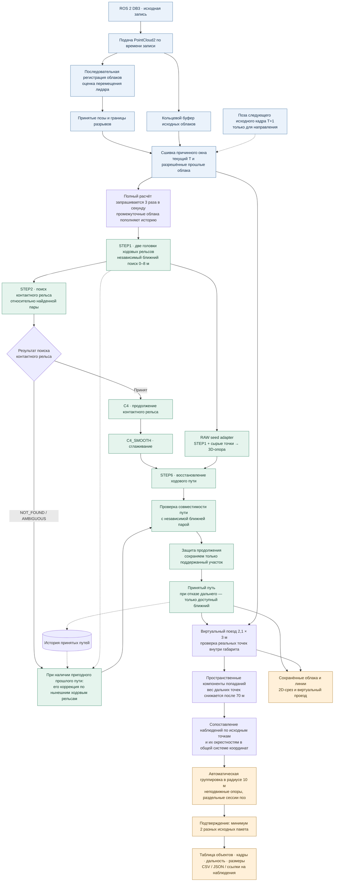
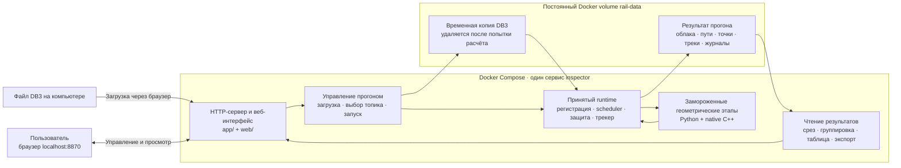

# Архитектура Rail Inspector

Схемы отображаются прямо на GitHub. Первая показывает расчёт, вторая — состав запускаемого приложения. Подробности этапов и сопоставления объектов — в [описании метода](ARCHITECTURE.md), управление демонстрацией — в [WEB_GUIDE.md](WEB_GUIDE.md).

## От облака до объекта

**Что важно при чтении схемы:**

- Промежуточные облака не теряются намеренно ради частоты 3 Гц: они участвуют в регистрации и истории. При перегрузке ожидающий элемент заменяется более свежим, поэтому растущей FIFO-очереди нет. Это не гарантирует обработку каждого облака.
- T+1 нужен для направления. Его облако допускается в изолированный регистрационный probe, но **не передаётся геометрическим детекторам**. В их входе нет будущих облаков, карты-эталона или class1/class2.
- Коррекция прошлого пути по ходовым — запасная ветка при `NOT_FOUND` / `AMBIGUOUS`, а не дополнительная правка поверх успешно принятой контактной геометрии.
- Если регистрация, опора или продолжение не приняты, дальний участок может отсутствовать. Его отсутствие означает «неизвестно», а не «путь свободен».
- Группировка 10 м меняет только представление объектов после геометрии. Она не двигает рельсы и не меняет список точек-попаданий. Разные близкие предметы могут объединиться.

## Что запускает Docker

Временная копия входа читается из файловой системы Docker. Исходный файл пользователя остаётся неизменным. Сохранённые результаты переживают закрытие вкладки и обычный `docker compose down` без `-v`.

Это воспроизведение ROS 2 записи по timestamps, а не подписка на живой DDS. Веб-просмотрщик читает готовые результаты и не влияет на inference. Полный путь к реализации каждого блока приведён в [ARCHITECTURE.md](ARCHITECTURE.md#папки).
